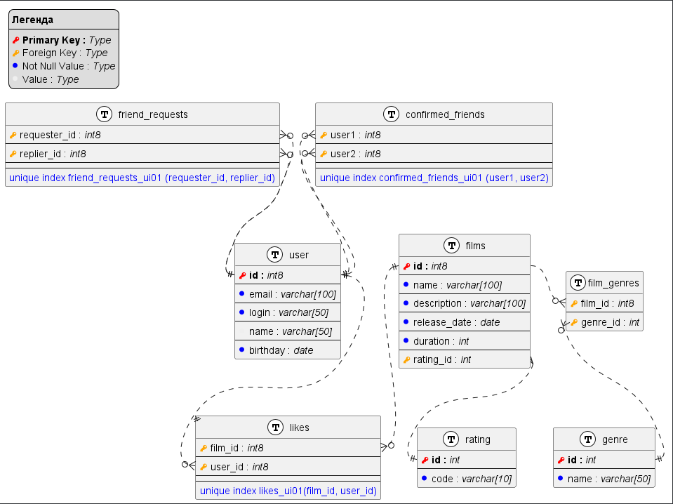

# java-filmorate

## Схема БД



<details><summary>код схемы в plantuml</summary>

```plantuml
!define table(name, desc) class name as "desc" << (T, white) >>

!define pk(x, t) <b><color:#red><&key></color> x :</b> <i>t</i>
!define fk(x, t) <color:#orange><&key></color> x : <i>t</i>
!define nn(x, t) <color:#blue><&media-record></color> x : <i>t</i>
!define col(x, t) <color:#efefef><&media-record></color> x : <i>t</i>

skinparam packageStyle rectangle
hide stereotypes
allowmixing

legend top left
<b>Легенда</b>
----
pk("Primary Key", "Type")
fk("Foreign Key", "Type")
nn("Not Null Value", "Type")
col("Value", Type)
end legend

table(users, "user") {
    pk(id, int8)
    ----
    nn(email, varchar[100]) 
    ----
    nn(login, varchar[50]) 
    ----
    col(name, varchar[50])
    ----
    nn(birthday, date)
}

table(requests, "friend_requests") {
    fk(requester_id, int8)
    ----
    fk(replier_id, int8)
    ----
    ----
    <color:blue>unique index requests_ui01 (requester_id, replier_id)</color>
}

table(friends, "confirmed_friends") {
    fk(user1, int8)
    ----
    fk(user2, int8)
    ----
    ----
    <color:blue>unique index requests_ui01 (user1, user2)</color>
}

table(films, "films") {
    pk(id, int8)
    ----
    nn(name, varchar[100]) 
    ----
    nn(description, varchar[100])
    ----
    nn(release_date, date) 
    ----
    nn(duration, int)
}

table(likes, "likes") {
    fk(film_id, int8)
    ----
    fk(user_id, int8)
    ----
    ----
    <color:blue>unique index likes_ui01(film_id, user_id)</color>
}

requests::requester_id }o..|| users::id
requests::replier_id }o..|| users::id

friends::user1 }o..|| users::id
friends::user2 }o..|| users::id

films::id ||..o{ likes::film_id
users::id ||..o{ likes::user_id
```

</details>